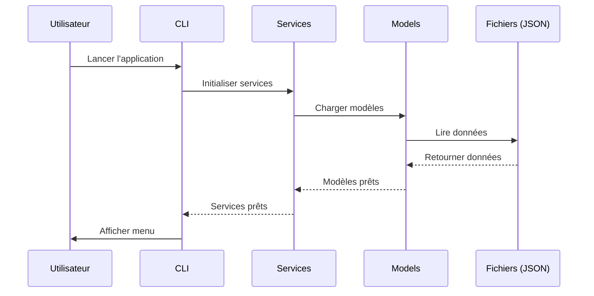
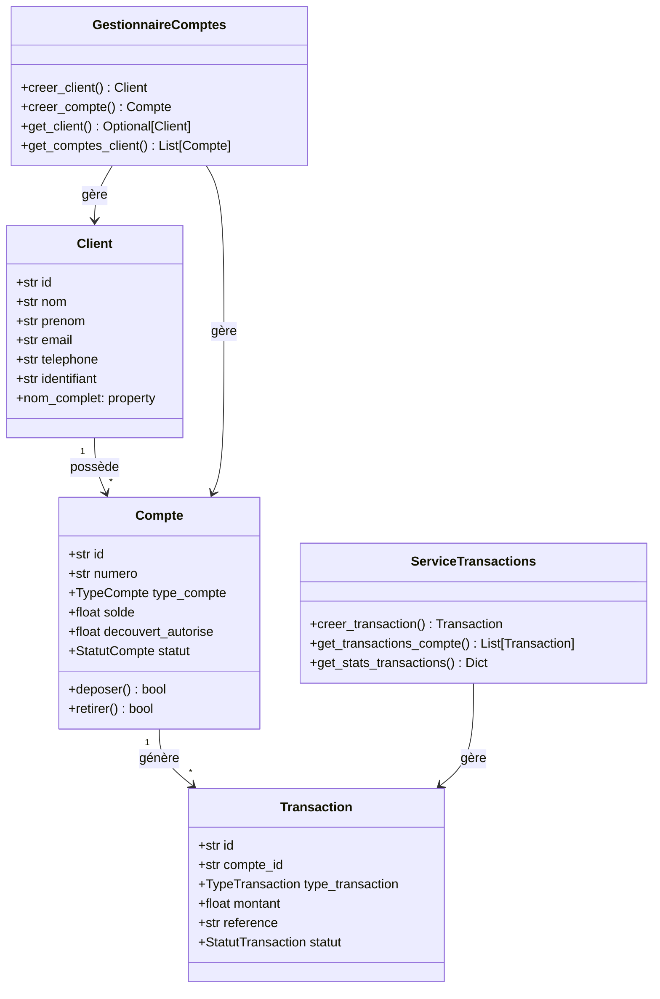

# projet_01_systeme_bancaire

Système Bancaire CLI complet avec gestion des clients, comptes et transactions.

---

## Introduction

Ce projet implements un système bancaire complet en Python avec une interface CLI moderne. Il permet de gérer des clients, des comptes bancaires, des transactions et offre des fonctionnalités de reporting.

**Concepts clés:** POO, Héritage, Polymorphisme, Encapsulation, Classes abstraites

**Outils:** Python 3.10+, argparse, dataclasses, enum, json

---

## Prérequis

- Module recommandé: Chapitres 08-13 (Fonctions et POO)

---

## Structure

```
projet_01_systeme_bancaire/
├── src/
│   ├── main.py                    # Point d'entrée CLI
│   ├── models/
│   │   └── __init__.py           # Client, Compte, Transaction, CarteBancaire, Pret
│   ├── services/
│   │   ├── __init__.py
│   │   ├── gestionnaire_comptes.py    # Gestion clients et comptes
│   │   └── service_transactions.py    # Gestion transactions
│   └── utils/
│       ├── __init__.py
│       ├── config.py              # Configuration
│       └── date_utils.py          # Utilitaires de date
├── tests/
│   ├── test_main.py
│   ├── test_models.py
│   └── test_services.py
├── data/                          # Stockage JSON
└── README.md
```

---

## Fonctionnalités

### 1. Gestion des Clients

- Création de clients avec informations complètes
- Recherche de clients par nom, prénom ou email
- Liste de tous les clients

### 2. Gestion des Comptes

- Création de comptes (Courant, Epargne, Professionnel, Joint)
- Gestion du découvert autorisé
- Historique des opérations
- Blocage/reactivation de comptes

### 3. Transactions

- Dépôts en espèces
- Retraits
- Suivi des transactions avec références uniques
- Statistiques des transactions

### 4. Rapports

- Solde total des comptes
- Statistiques détaillées (dépots, retraits, solde net)

---

## Modèle de Données

```python
# Types de comptes
class TypeCompte(Enum):
    COURANT = "courant"
    EPARGNE = "epargne"
    PROFESSIONNEL = "professionnel"
    JOINT = "joint"

# Client
@dataclass
class Client:
    id: str
    nom: str
    prenom: str
    email: str
    telephone: str
    adresse: str = ""
    identifiant: str = ""  # Auto-généré: CLI-XXXXXXXX

# Compte
@dataclass
class Compte:
    id: str
    numero: str              # 12 chiffres
    client_id: str
    type_compte: TypeCompte
    solde: float = 0.0
    decouvert_autorise: float = 0.0
    taux_interet: float = 0.0
    statut: StatutCompte = StatutCompte.ACTIF
    historique: List[str] = field(default_factory=list)

# Transaction
@dataclass
class Transaction:
    id: str
    compte_id: str
    type_transaction: TypeTransaction
    montant: float
    reference: str = ""     # Auto-généré: TRX-XXXXXXXXXXXX
```

---

## Utilisation

### Mode interactif

```bash
python src/main.py
```

### Commandes disponibles

L'application offre un menu interactif complet :

1. **Gestion des clients**
   - Créer un nouveau client
   - Lister les clients
   - Rechercher un client

2. **Gestion des comptes**
   - Créer un compte pour un client
   - Lister tous les comptes
   - Effectuer un dépôt
   - Effectuer un retrait
   - Bloquer/reactiver un compte

3. **Transactions**
   - Effectuer un dépôt
   - Effectuer un retrait
   - Voir l'historique

4. **Rapports**
   - Solde total
   - Statistiques détaillées

---

## Installation

```bash
# Lancer l'application
python src/main.py

# Exécuter les tests
pytest tests/

# Vérifier le projet
python verification.py
```

---

## Architecture

### Flux de Données



### Modèle de Classes



---

## Exemple d'Utilisation

```python
from src.services.gestionnaire_comptes import GestionnaireComptes
from src.services.service_transactions import ServiceTransactions
from src.models import TypeCompte, TypeTransaction

# Créer un gestionnaire
gestionnaire = GestionnaireComptes()

# Créer un client
client = gestionnaire.creer_client(
    nom="Dupont",
    prenom="Jean",
    email="jean.dupont@email.com",
    telephone="0612345678"
)
print(f"Client créé: {client.identifiant}")

# Créer un compte
compte = gestionnaire.creer_compte(
    client_id=client.id,
    type_compte=TypeCompte.COURANT,
    decouvert_autorise=500.0
)
print(f"Compte créé: {compte.numero}")

# Effectuer des transactions
transactions = ServiceTransactions()
transactions.creer_transaction(
    compte_id=compte.id,
    type_transaction=TypeTransaction.DEPOT,
    montant=1000.0,
    description="Salaire"
)
```

---

## Tests

Les tests vérifient :
- L'initialisation de l'application
- La création de modèles
- L'initialisation des services

```python
# Exemple de test
def test_initialization():
    from src.main import Projet01SystemeBancaireApplication
    app = Projet01SystemeBancaireApplication()
    assert app is not None
```

---

## Ressources

- Documentation Python: https://docs.python.org/fr/3/
- Documentation dataclasses: https://docs.python.org/fr/3/library/dataclasses.html
- Documentation enum: https://docs.python.org/fr/3/library/enum.html

---

*Durée estimée: 6-8 heures | Difficulté: Intermédiaire | Version: 1.0.0*

---

[Retour au module](../README_PROJETS.md)
