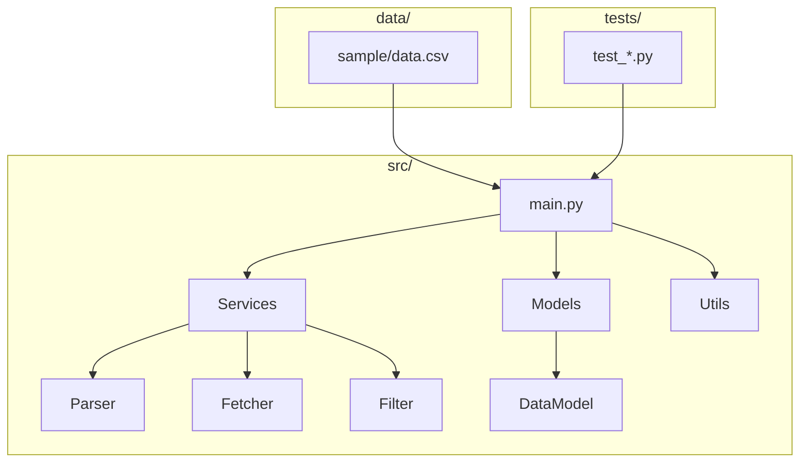
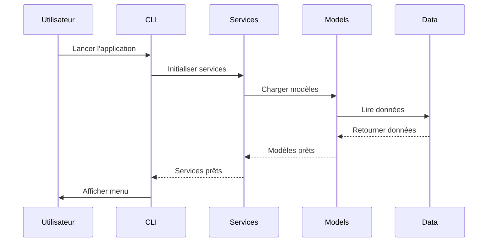
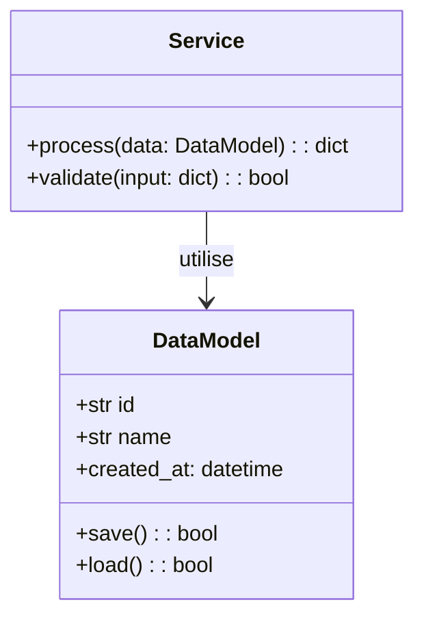
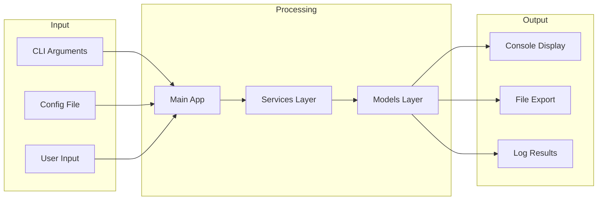

# projet_01_systeme_bancaire

L'automatisation permet de programmer des tâches répétitives.

---

## Introduction

Ce projet vous permet d'appliquer planification dans un projet réel et professionnel.

**Concepts clés:** Planification, Emails, APIs, Logs

**Outils:** jinja2, matplotlib, smtplib

---

## Prérequis

- Module recommandé: Chapitres 20-26

---

## Structure

```
projet_01_systeme_bancaire/
├── src/
│   ├── main.py
│   ├── models/
│   ├── services/
│   └── utils/
├── tests/
├── data/
└── README.md
```

---

## Fonctionnalités

### 1. Fonctionnalité principale

- Implémentation de base
- Tests associés
- Documentation

---

## Modèle de Données

```python
from dataclasses import dataclass
from datetime import datetime
from typing import Optional
from enum import Enum

class Status(Enum):
    PENDING = "pending"
    PROCESSING = "processing"
    COMPLETED = "completed"
    FAILED = "failed"

@dataclass
class Item:
    id: str
    name: str
    status: Status = Status.PENDING
    created_at: datetime = None
    
    def __post_init__(self):
        if self.created_at is None:
            self.created_at = datetime.now()
```

---

## Indications

### Niveau 1

```python
class Project:
    def __init__(self):
        self.data = []
    
    def run(self):
        pass
```

---

## Critères de Validation

- [ ] Structure du projet
- [ ] Fonctionnalités implémentées
- [ ] Tests passent
- [ ] Code documenté

---


---

## Architecture et Diagrammes

### Architecture du Projet



### Flux de Données



### Modèle de Données



### Architecture Fonctionnelle


## Installation

```bash
python src/main.py
pytest tests/
python verification.py
```

---

## Ressources

- Documentation Python: https://docs.python.org/fr/3/

---

*Durée estimée: 8-12 heures | Difficulté: Outils:*

---

[Retour au module](../README_PROJETS.md)
