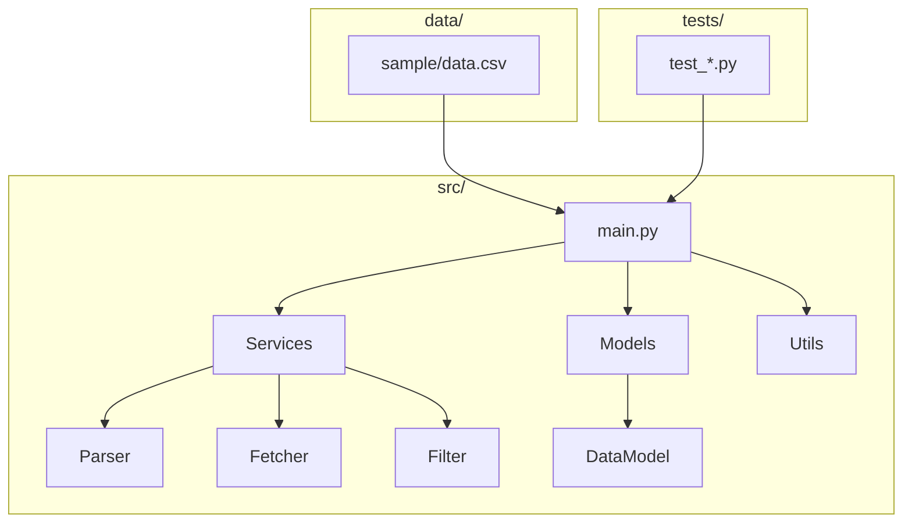
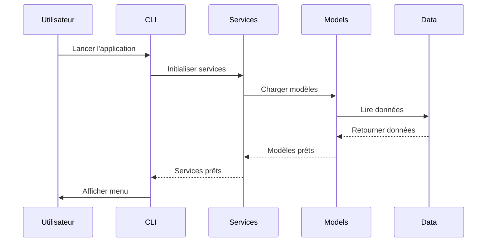
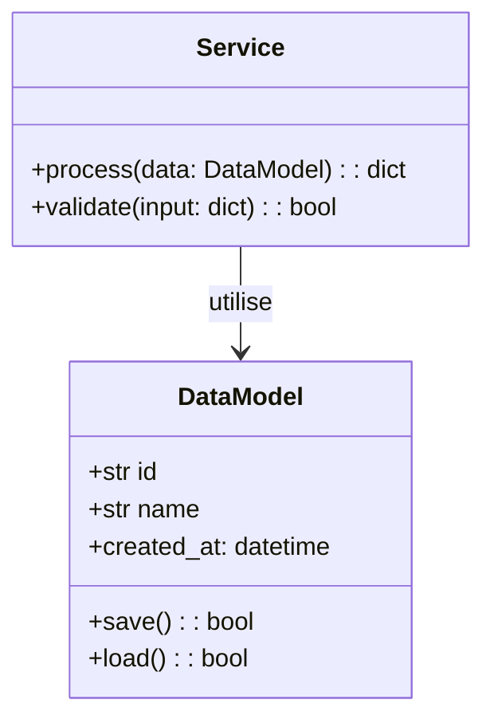
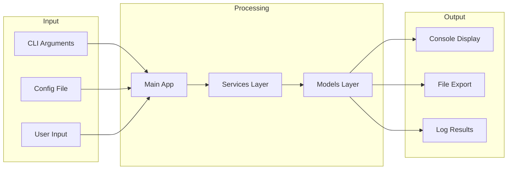

# Projet 1 : Agrégateur d'Actualités RSS

Créez un agrégateur de flux d'actualités intelligent qui rassemble les dernières nouvelles de plusieurs sources en un seul endroit.

---

## Introduction : Qu'est-ce qu'un Agrégateur RSS ?

Un agrégateur RSS (Really Simple Syndication) est un outil qui :
- Centralise les actualités de plusieurs sites web
- Filtre les articles par mots-clés ou catégories
- Permet une lecture organisée et efficace

**Exemples d'utilisation réelle :**
- **Feedly** : Agrégateur web populaire
- **Inoreader** : Alternative puissante
- **Netvibes** : Page d'accueil personnalisée

**Architecture du système :**
```
┌─────────────────────────────────────────────────────────┐
│              AGRÉGATEUR D'ACTUALITÉS                   │
├─────────────────────────────────────────────────────────┤
│  SOURCES:           │  FONCTIONNALITÉS:                 │
│  - Le Monde         │  ✓ Parsing RSS/Atom              │
│  - TechCrunch      │  ✓ Filtres par mots-clés         │
│  - GitHub Blog     │  ✓ Pagination CLI                │
│  - CNN             │  ✓ Historique des lectures        │
│                    │  ✓ Export des articles           │
└─────────────────────────────────────────────────────────┘
```

---

## Prérequis

- **Module 5 requis** : [Web Scraping](../../05_domaines_specifies/21_web_scraping/README_MODULE.md)
- Compétences nécessaires :
  - Requêtes HTTP avec `requests`
  - Parsing XML avec `xml.etree.ElementTree`
  - Manipulation de dates avec `datetime`
  - Structures de données avancées

---

## Structure du Projet

```
projet_01_aggregateur_actualites/
├── src/
│   ├── main.py              # Point d'entrée CLI
│   ├── models/
│   │   ├── feed.py          # Classes Feed, Article
│   │   └── article.py       # Classe Article
│   ├── services/
│   │   ├── rss_parser.py    # Parsing des flux
│   │   ├── fetcher.py       # Téléchargement HTTP
│   │   ├── filter.py        # Filtrage intelligent
│   │   └── cache.py         # Mise en cache
│   └── utils/
│       ├── date_utils.py    # Formatage de dates
│       └── config.py        # Configuration
├── tests/
│   ├── test_parser.py
│   ├── test_filter.py
│   └── test_main.py
├── data/
│   ├── sample/              # Exemples de flux
│   │   ├── le_monde.xml
│   │   └── github_blog.xml
│   └── subscriptions.json   # Configuration
├── README.md
└── requirements.txt
```

---

## Fonctionnalités

### 1. Parsing des Flux RSS/Atom

Les flux RSS sont des fichiers XML structurés :

```xml
<?xml version="1.0" encoding="UTF-8"?>
<rss version="2.0">
  <channel>
    <title>Le Monde</title>
    <link>https://www.lemonde.fr</link>
    <item>
      <title>Titre de l'article</title>
      <description>Résumé...</description>
      <link>https://article.html</link>
      <pubDate>Sat, 07 Feb 2026 10:30:00 +0000</pubDate>
    </item>
  </channel>
</rss>
```

### 2. Format des Dates RSS

Les dates RSS utilisent le format RFC 822/1123 :

```python
from datetime import datetime

# Format RSS
date_rss = "Sat, 07 Feb 2026 10:30:00 +0000"

# Conversion en datetime
date_obj = datetime.strptime(date_rss, "%a, %d %b %Y %H:%M:%S %z")
```

### 3. Filtrage par Mots-Clés

```python
FILTRES = {
    "inclure": ["Python", "programmation"],
    "exclure": ["publicité", "sponsorisé"]
}

def filtrer(articles, filtres):
    resultat = []
    for article in articles:
        texte = article.titre + " " + article.description
        if any(m in texte for m in filtres["inclure"]):
            if not any(m in texte for m in filtres["exclure"]):
                resultat.append(article)
    return resultat
```

### 4. Interface CLI Interactive

```
╔══════════════════════════════════════════════════╗
║         AGRÉGATEUR D'ACTUALITÉS RSS             ║
╠══════════════════════════════════════════════════╣
║  1. Afficher articles    2. Rafraîchir flux     ║
║  3. Rechercher          4. Ouvrir navigateur    ║
║  5. Marquer lu          6. Gérer abonnements   ║
║  7. Quitter                                      ║
╚══════════════════════════════════════════════════╝
```

---

## Modèle de Données

```python
from dataclasses import dataclass
from datetime import datetime
from typing import Optional
from enum import Enum


class LuStatus(Enum):
    NON_LU = "non_lu"
    EN_COURS = "en_cours"
    LU = "lu"


@dataclass
class Article:
    titre: str
    description: str
    lien: str
    date_publication: datetime
    source: str
    categorie: Optional[str] = None
    guid: Optional[str] = None
    statut_lecture: LuStatus = LuStatus.NON_LU
    date_ajout: datetime = None
    
    def __post_init__(self):
        if self.date_ajout is None:
            self.date_ajout = datetime.now()
        if self.guid is None:
            self.guid = self.lien
    
    def est_recent(self, jours: int = 7) -> bool:
        delta = datetime.now() - self.date_publication
        return delta.days < jours


@dataclass
class FluxRSS:
    nom: str
    url: str
    categorie: str
    articles: list[Article] = None
    
    def __post_init__(self):
        if self.articles is None:
            self.articles = []
    
    @property
    def nb_articles(self) -> int:
        return len(self.articles)
```

---

## Indications Progressives

### Niveau 1 - Découverte

**Objectif:** Parser un flux RSS simple

```python
import xml.etree.ElementTree as ET
from datetime import datetime
from typing import Optional


class RSSParser:
    DATE_FORMATS = [
        "%a, %d %b %Y %H:%M:%S %z",
        "%a, %d %b %Y %H:%M:%S GMT",
        "%Y-%m-%dT%H:%M:%SZ",
    ]
    
    def parser_date(self, date_str: str) -> Optional[datetime]:
        for fmt in self.DATE_FORMATS:
            try:
                return datetime.strptime(date_str, fmt)
            except ValueError:
                continue
        return None
    
    def parser_flux(self, contenu_xml: str) -> dict:
        root = ET.fromstring(contenu_xml)
        pass
```

**Indice:** Affichez la structure XML d'abord :
```python
for elem in ET.fromstring(xml).iter():
    print(elem.tag, elem.attrib)
```

---

### Niveau 2 - Approfondissement

**Objectif:** Téléchargement et filtrage robustes

```python
import requests
from typing import Optional


class FeedFetcher:
    def __init__(self, timeout: int = 10):
        self.timeout = timeout
        self.cache = {}
    
    def telecharger(self, url: str, use_cache: bool = True) -> Optional[str]:
        if use_cache and url in self.cache:
            return self.cache[url]
        
        try:
            reponse = requests.get(url, timeout=self.timeout)
            reponse.raise_for_status()
            contenu = reponse.text
            self.cache[url] = contenu
            return contenu
        except requests.RequestException as e:
            print(f"Erreur: {e}")
            return None
```

---

### Niveau 3 - Expert

**Objectif:** Application CLI complète avec pagination

```python
class AggregateurApp:
    def __init__(self):
        self.fetcher = FeedFetcher()
        self.flux: list[FluxRSS] = []
        self.page_courante = 1
        self.articles_par_page = 10
    
    def afficher_articles(self, page: int = 1):
        tous = []
        for flux in self.flux:
            tous.extend(flux.articles)
        
        tous.sort(key=lambda a: a.date_publication, reverse=True)
        
        debut = (page - 1) * self.articles_par_page
        fin = debut + self.articles_par_page
        
        for i, article in enumerate(tous[debut:fin], debut + 1):
            statut = "N" if article.statut_lecture.value == "non_lu" else "L"
            print(f"[{i}] [{statut}] {article.titre}")
```

---

## Configuration

Créez `data/subscriptions.json` :

```json
{
  "abonnements": [
    {"nom": "Le Monde - Tech", "url": "...", "categorie": "tech"},
    {"nom": "GitHub Blog", "url": "...", "categorie": "tech"}
  ],
  "filtres": {
    "mots_cles_inclure": [],
    "mots_cles_exclure": ["publicité", "sponsorisé"]
  }
}
```

---

## Critères de Validation

- [ ] Parsing RSS 2.0 et Atom
- [ ] Conversion dates RSS vers datetime
- [ ] Filtres mots-clés fonctionnels
- [ ] Pagination CLI
- [ ] Gestion d'erreurs robuste
- [ ] Type hints et docstrings

---

## Pièges Courants

### 1. Encodage
```python
reponse.encoding = 'utf-8'
```

### 2. Flux malformés
```python
try:
    tree = ET.fromstring(contenu)
except ET.ParseError:
    pass
```

### 3. Dates impossibles
```python
date = parser_date(date_str) or datetime.now()
```

---


---

## Architecture et Diagrammes

### Architecture du Projet



### Flux de Données



### Modèle de Données



### Architecture Fonctionnelle


## Installation et Utilisation

```bash
uv sync --extra web-scraping
python src/main.py
pytest tests/ -v
python verification.py
```

---

## Ressources

- [RSS 2.0 Specification](https://validator.w3.org/feed/docs/rss2.html)
- [xml.etree.ElementTree](https://docs.python.org/3/library/xml.etree.elementtree.html)
- [Requests](https://docs.python-requests.org/)

**Flux RSS d'exemple :**
- Le Monde : `https://www.lemonde.fr/rss/une.xml`
- GitHub Blog : `https://github.blog/feed/`

---

## Objectifs d'Apprentissage

- Parser des documents XML avec Python
- Gérer différents formats de dates
- Implémenter un système de cache
- Créer une interface CLI interactive
- Manipuler des flux HTTP avec requests
- Appliquer des filtres sur des données textuelles

---

*Durée estimée : 8-12 heures | Difficulté : Avancé*

---

[Retour au module](../README_PROJETS.md)
